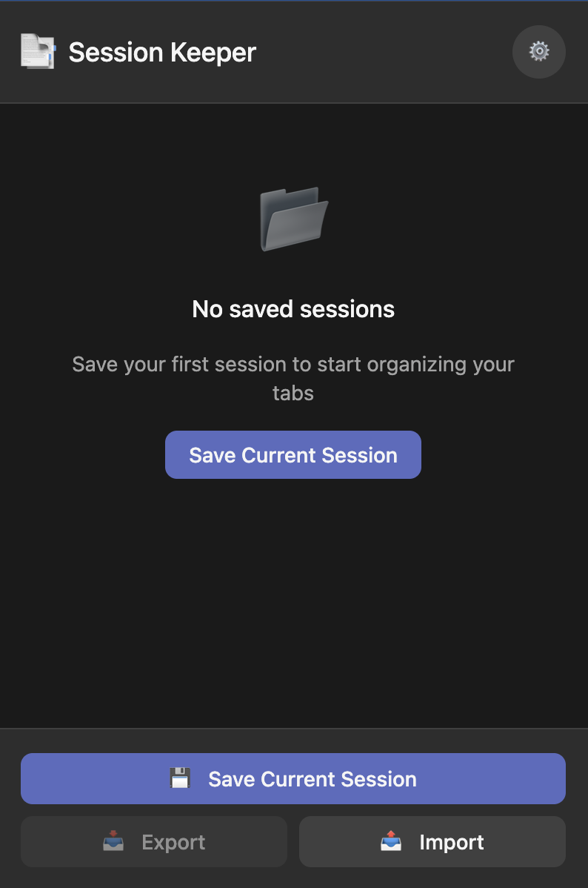

# SessionKeeper

A Chrome extension for saving and restoring browser sessions with multi-window support.

<p align="center">
  
</p>

## Features

- **Save Sessions**: Capture all open tabs across multiple windows
- **Restore Sessions**: Restore to new window or current window
- **Duplicate Detection**: Avoid reopening already open tabs
- **Tags**: Organize sessions with customizable colored tags
- **Search & Filter**: Find sessions by name or filter by tags
- **Import/Export**: Backup and share sessions as JSON files

## Installation

### From Source

```bash
# Clone the repository
git clone https://github.com/yourusername/sessionkeeper.git
cd sessionkeeper

# Install dependencies (requires Bun)
bun install

# Build the extension
bun run build
```

Then load the extension in Chrome:
1. Go to `chrome://extensions/`
2. Enable "Developer mode"
3. Click "Load unpacked"
4. Select the `dist` folder

### Development

```bash
# Run development server with hot reload
bun run dev

# Run tests
bun test

# Run tests in watch mode
bun test --watch
```

## Architecture

The project follows Domain-Driven Design (DDD) principles with bounded contexts:

### Bounded Contexts

- **Storage**: IndexedDB persistence using Dexie.js
  - Session CRUD operations
  - Tag management
  - Settings storage

- **SessionManagement**: Tab capture and editing
  - Capture all open tabs from all windows
  - URL validation and filtering
  - Duplicate detection

- **SessionRestoration**: Session restoration logic
  - Restore to new window(s)
  - Restore to current window
  - Progress tracking

- **ImportExport**: Data portability
  - JSON export format (v1.0.0)
  - Merge or replace import strategies
  - Data validation

- **UI**: React-based popup interface
  - 400x600px popup layout
  - Accessible components
  - Toast notifications

## Tech Stack

- **Runtime**: Bun
- **Language**: TypeScript
- **UI**: React 18
- **Storage**: Dexie.js (IndexedDB)
- **Build**: Vite + @crxjs/vite-plugin
- **Testing**: Bun test + happy-dom
- **Extension**: Chrome Manifest V3

## Project Structure

```
src/
├── background/           # Service worker
├── storage/              # IndexedDB layer (Dexie)
│   ├── db.ts             # Schema and migrations
│   ├── session-operations.ts
│   ├── tag-operations.ts
│   └── errors.ts
├── session-management/   # Tab capture and restore
│   ├── tab-capture.ts
│   ├── session-restore.ts
│   ├── duplicate-detection.ts
│   └── url-validation.ts
├── import-export/        # JSON export/import
│   ├── export.ts
│   ├── import.ts
│   └── types.ts
└── popup/                # React UI
    ├── App.tsx
    ├── components/
    │   ├── SessionList.tsx
    │   ├── SessionCard.tsx
    │   ├── SaveSessionModal.tsx
    │   ├── EditSessionModal.tsx
    │   ├── RestoreOptionsModal.tsx
    │   ├── QuickActionsBar.tsx
    │   ├── SearchFilterBar.tsx
    │   ├── TagManagementPanel.tsx
    │   ├── Toast.tsx
    │   └── ConfirmModal.tsx
    ├── hooks/
    │   ├── useSessions.ts
    │   ├── useDeleteSession.ts
    │   ├── useRestoreSession.ts
    │   └── useDuplicateDetection.ts
    └── utils/
        └── formatRelativeDate.ts
```

## Design Principles

- **Functional Paradigm**: Pure functions, immutability, composition
- **Result Pattern**: `Result<T, E>` for error handling without exceptions
- **UUID v4**: Session identifiers to avoid import conflicts
- **Accessibility**: Full keyboard navigation, ARIA labels, focus management

## Contributing

Contributions are welcome! Please read the code style guidelines in CLAUDE.md before submitting PRs.

## License

MIT
